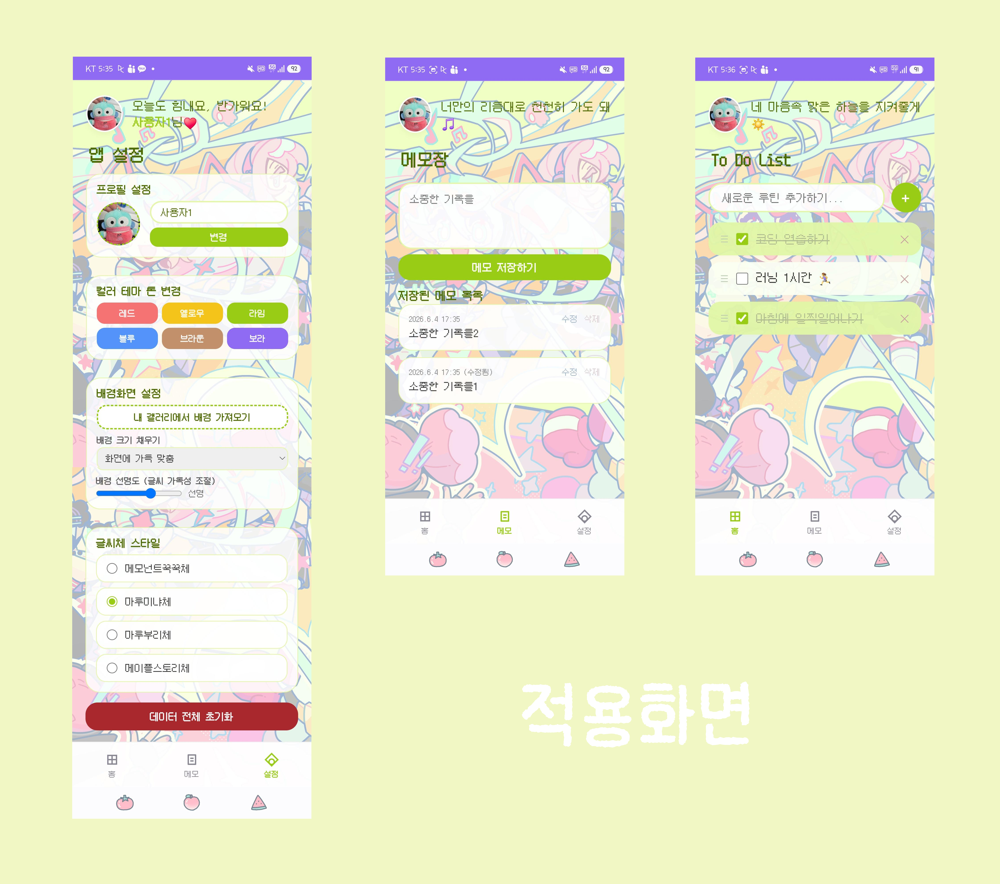

# 📝 파스텔 루틴 투두리스트 (Pastel Routine Todo)

귀엽고 따뜻한 파스텔 톤의 테마와 힐링 메시지로 기분 좋게 하루를 시작할 수 있는 **웹 기반 루틴 투두리스트 및 비밀 메모장**입니다. 사용자의 취향에 맞게 프로필, 테마, 배경화면, 글씨체까지 자유롭게 커스텀할 수 있습니다. 프로그레시브 웹 앱(PWA) 기술이 적용되어 모바일 환경에서도 네이티브 앱처럼 자연스럽게 동작합니다.

## ✨ 주요 기능

### 1. 🏠 홈 (오늘의 할 일)

* **스마트 루틴 관리:** 매일 자정(한국 시간 기준)이 지나면 체크 완료된 항목들이 자동으로 초기화되어, 매일 반복되는 루틴을 쉽게 관리할 수 있습니다.

* **드래그 앤 드롭:** 할 일 목록의 순서를 드래그(PC)하거나 터치 이동(모바일)하여 직관적으로 변경할 수 있습니다.

* **랜덤 힐링 메시지:** 탭을 이동하거나 앱을 열 때마다 기분 좋은 18가지의 랜덤 응원 메시지가 상단에 표시됩니다.

* **자유로운 타이틀:** '오늘의 할 일' 제목을 클릭하여 나만의 문구로 바로 수정할 수 있습니다.

### 2. 📓 비밀 메모장

* 날짜와 시간이 함께 기록되는 간단한 메모 공간입니다.

* 소중한 기록이나 일기를 남기고 손쉽게 관리할 수 있습니다.

### 3. 🎨 완벽한 커스텀 (앱 설정)

* **프로필 꾸미기:** 나만의 닉네임과 갤러리 사진으로 프로필을 설정할 수 있습니다.

* **6가지 파스텔 테마:** 보라, 레드, 옐로우, 그린옐로우, 블루, 브라운 총 6가지의 따뜻한 컬러 톤을 지원합니다.

* **배경화면 설정:** 갤러리에서 원하는 이미지를 불러와 배경으로 지정하고, 이미지 비율(채우기/원래 비율/바둑판)과 배경 선명도(가독성을 위한 투명도)를 조절할 수 있습니다.

* **4가지 커스텀 폰트:** 메모넌트꾹꾹체, 마루미냐체, 마루부리체, 메이플스토리체 중 하나를 선택해 앱 전체의 글씨체를 변경할 수 있습니다.

## 🛠 기술 스택

* **Frontend:** HTML5, CSS3, Vanilla JavaScript

* **Data Storage:** 브라우저 `LocalStorage`를 활용하여 새로고침해도 데이터가 안전하게 유지됩니다.

* **PWA:** `manifest.json`을 통해 홈 화면에 추가하여 독립적인(Standalone) 전체화면 앱처럼 사용할 수 있습니다.

## 📱 UI / UX

* 윈도우 스타일의 심플하고 직관적인 하단 내비게이션 바를 적용하여 홈, 메모, 설정 화면 간의 이동이 매끄럽습니다.

* 스크롤 시 마지막 항목이 내비게이션 바에 가려지지 않도록 여백을 확보하여 사용자 편의성을 높였습니다.

---

